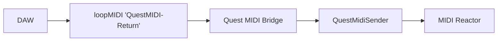

# GANTASMO MIDI Reactor

A head-mounted, MIDI-reactive chrome that closes the loop with **theDAW XR**. It builds a
curved chrome shield in front of the headset camera and drives its glow, hue, pulse, and
warp from MIDI arriving on the **return circuit**:

It is the receive-side counterpart to the QuestMidiBridge send path, so the headset reacts
live to whatever the DAW (or any MIDI source) plays at it.

## Install

**GANTASMO > MIDI Reactor > Add To Scene** adds the component to the scene, mounts it to the
main camera, and wires the `QuestMidiSender` automatically. It builds its mesh and chrome
material at runtime, so there is nothing to author.

(Manual path: add the **MIDI Reactor** component to any GameObject; it finds the camera and
the sender on enable.)

## Reactivity (defaults, all remappable in the Inspector)

| Input | Drives |
|---|---|
| CC 1 | steady glow level |
| CC 2 | hue shift |
| CC 3 (or pitch bend) | warp and breathing scale |
| Note On | a velocity-scaled flash that decays |

**Channel** selects the source. Setting it to 16 (for example) matches a DAW that sends the
reactor feed on channel 16, and leaving it at 0 accepts all channels.

## Requirements

- The QuestMidiBridge module in the same project, which provides `QuestMidiSender` and the
  desktop bridge that completes the circuit.
- A second loopMIDI port named **QuestMIDI-Return** for the DAW-to-headset direction (the
  bridge opens it as a MIDI input). The bridge's setup wizard and README cover this.
- URP (this project) or built-in. The reactor picks the URP Lit shader and falls back to
  Standard.

## How it reacts (signal path)

`QuestMidiSender` reads the return frames off the same TCP socket it already sends on,
parses them, and raises `ControlChangeReceived` / `NoteOnReceived` / `PitchBendReceived` on
the main thread. The MIDI Reactor subscribes and maps them to material emission, base
colour, and transform on each frame.
