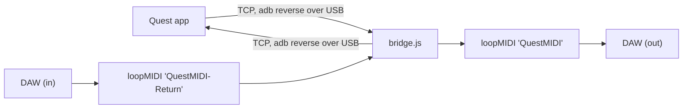

# Quest MIDI Bridge (desktop side)

This Node program is a **two-way** bridge between the Quest Unity app and a WebMIDI DAW,
over the USB-C cable.

The IN path completes the circuit: whatever the DAW writes to the return port is forwarded
to the headset, where any app-side receiver reacts to it live.

## One-time setup

1. Install **Node.js** (https://nodejs.org, the LTS build is fine).
2. Install **loopMIDI** (https://www.tobias-erichsen.de/software/loopmidi.html).
   - Create a port named exactly **`QuestMIDI`** (Quest to DAW).
   - Create a SECOND port named **`QuestMIDI-Return`** (DAW to Quest) for the return
     circuit. A separate name isolates the two directions and prevents an echo of the
     Quest's own data.
   - Both names come from the Unity Setup Wizard and `bridge-config.json`.
3. Install **adb** (Android platform-tools). With Unity's Android Build Support installed, it
   already lives at `<AndroidSDK>/platform-tools/adb.exe`.

> The Unity **Setup Wizard** (GANTASMO > MIDI Bridge > Setup Wizard) automates most of this,
> including writing `bridge-config.json` and launching this bridge.

## Every session

Double-click **`start-bridge.bat`**. It will:

- run `npm install` on the first launch (it downloads a prebuilt MIDI binary, with no
  compiler needed),
- run `adb reverse` to open the USB tunnel,
- open the loopMIDI port and start listening.

The window stays open during a performance, and `Ctrl+C` stops it.

## bridge-config.json

| key | meaning |
|---|---|
| `tcpPort` | must match the port on the Unity `QuestMidiSender` component |
| `midiPortName` | substring of the loopMIDI OUTPUT port to open (Quest to DAW) |
| `midiInPortName` | substring of the loopMIDI INPUT port to open (DAW to Quest, return circuit) |
| `adbPath` | `adb` (when on PATH) or a full path to `adb.exe` |
| `autoAdbReverse` | run `adb reverse` automatically on startup |
| `verbose` | log every MIDI message (hex) for debugging |

## Troubleshooting

- **"No port matching QuestMIDI"**: create that port in loopMIDI. The bridge keeps retrying,
  so creating it is enough.
- **"adb reverse FAILED"**: connect USB-C, accept *Allow USB debugging* on the headset, and
  confirm `adb devices` lists it.
- **The DAW does not see the port**: WebMIDI reads OS MIDI ports, so loopMIDI must be
  running, and the DAW page may need a refresh or a `requestMIDIAccess()` re-query.
- **Editor Play mode test**: the Unity app connects to the PC's localhost directly, so the
  whole chain runs without the headset or adb.
