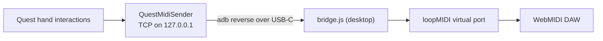

# Quest MIDI Bridge

The MIDI transport for **theDAW XR**. It carries MIDI in both directions between a
standalone Quest 3 Unity app and a WebMIDI desktop DAW over the USB-C cable, with no
network connection required. Built for Unity 6.4 on Windows.

> For **theDAW** specifically, the loopMIDI step is optional. theDAW's `questmidi`
> backend module reads the bridge's TCP frames directly and republishes them on its
> global MIDI bus, so no virtual port and no Node bridge are needed. The loopMIDI path
> below is the general route for any other WebMIDI DAW.



## Fastest path

1. In Unity, open **GANTASMO > MIDI Bridge > Setup Wizard**. The checklist detects Node
   and adb, writes the config, installs dependencies, and starts the bridge.
2. Click **Add MIDI Sender to scene** in the wizard, then call it from hand-tracking code:

   ```csharp
   sender.SendNoteOn(60, 110);       // pinch to note
   sender.SendControlChange(1, 64);  // 0-127 CC
   sender.SendControlChange14(1, t); // smooth 14-bit CC for hand motion
   ```

   `HandMidiExample.cs` contains a working mapper.
3. In the DAW, select the **QuestMIDI** input from the WebMIDI device list.

## Testing without the headset

Pressing **Play** in the Editor with the bridge running connects the app to the PC's
localhost directly, so the full chain (Unity, bridge, loopMIDI, DAW) runs on the desk
before deployment to the Quest. `adb reverse` becomes relevant once the app runs on the
headset.

## Design notes

- **Drop-in for the DAW.** loopMIDI appears as a normal MIDI input to WebMIDI, so the DAW
  opens it like any hardware controller.
- **USB and offline.** `adb reverse` rides the Link cable, so a performance runs entirely
  over USB.
- **Low latency.** Nagle is disabled at both ends, and adb-over-USB adds about 1 ms.
- **MIDI resolution.** Hand motion through 7-bit CC (0-127) can feel stepped, so
  `SendControlChange14` provides smooth control.

The Node side lives in `Bridge~/`. The `~` makes Unity ignore the folder, so it never
imports and never enters the APK.
