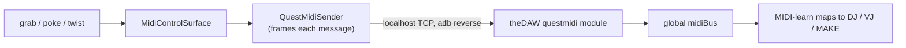

# GANTASMO XR MIDI Control Surface

The hand-tracking control surface inside **theDAW XR**. A 3D surface turns XR interactions
into MIDI and sends them to theDAW through the Quest MIDI bridge. The default is a curved
DJ fan: **6 faders on an upward arc, a horizontal crossfade, 8 knobs on an arc, and 12
buttons (a tilted upper row over a flat lower row)**, floating with no backboard. Faders
and knobs carry a `HandGrabInteractable` (hand and controller hand-grab); buttons carry a
`PokeInteractable`. Those are the interactables the Meta Building Blocks rig drives, so the
hands move them with no per-control wiring. A hamburger button opens an in-VR editor for
moving, scaling, and rotating the whole surface (see below).

## Build it

Run **GANTASMO > Control Surface > Build XR MIDI Control Surface**. The builder reads a
**config preset** (see below), creates a `GANTASMO XR MIDI Surface` GameObject in the open
scene, lays out the controls, wires them to a single `QuestMidiSender` through a
`MidiControlSurface`, and saves the prefab to `Assets/QuestMidiBridge/Prefabs/`. The root
floats at `(0, 1.05, 0.4)` by default.

## Config presets

The layout lives in data. The builder reads a `GantasmoSurfaceConfig` asset (auto-created
at `Assets/QuestMidiBridge/Config/GantasmoSurfaceConfig.asset` on first build). Selecting
and editing it changes the surface, per control group (sliders, knobs, buttons):

- **count**, **columns** (rows stack downward), and **spacing**
- **origin** (where the group sits within the root) and the root **position / rotation**
- **scale** of each control
- **material** for the grabbable or pressable part
- **customPrefab**, a custom 3D object used in place of the generated cube, which receives
  the interactable, the MIDI components, and a collider automatically
- **positionOverrides**, explicit per-control positions that beat the grid

Menu actions:

| Menu | Action |
|---|---|
| `GANTASMO > Control Surface > Build XR MIDI Control Surface` | Build from the default config |
| `GANTASMO > Control Surface > Reset Surface Config To Default Layout` | Rewrite the default preset to the curved DJ fan (run once if an older grid config already exists, then rebuild) |
| `GANTASMO > Control Surface > Create Surface Config Preset` | Make a new preset asset to edit (duplicate and tweak) |
| `GANTASMO > Control Surface > Build Surface From Selected Config` | Build from the preset selected in the Project window |
| `GANTASMO > Control Surface > Capture Surface Layout Into Selected Config` | Save a hand-arranged surface back into a preset (fills `positionOverrides`, counts, root transform) |

Arranging happens two ways: edit the preset and rebuild, or move controls in the Scene view
and **Capture** them back into a preset. Clearing `positionOverrides` returns to the grid.

## Edit the layout in VR

A hamburger button sits at the top-right of the surface. Poking it enters edit mode: the
controls stop sending MIDI and a green grab bar appears at the top. Grabbing the bar with
one hand moves the whole surface (and dragging it up raises the height); grabbing it with
both hands rotates and scales it. Poking **Save** writes the placement as this scene's
default, and poking **Done** leaves without saving. The saved placement is reapplied on the
next launch.

Saved layouts live in `Application.persistentDataPath`, keyed by scene and surface name, so
the Editor and the headset each keep their own and several scenes stay independent.
`SurfaceLayoutStore.Clear` (or deleting the JSON) returns the surface to its built
placement. Per-control nudging is authored in the Editor with **Capture Surface Layout**
(above); the in-VR editor moves the surface as a whole.

## The hand-tracking rig

The controls are interactables, and the hands provide the interactors. The surface is built
for the Meta Building Blocks **comprehensive interaction rig**, which ships hand-grab and
poke interactors (the same rig that `Scenes/QuestMIDI.unity` uses,
`[BuildingBlock] OVRComprehensiveInteractionRig`).

> **Why hand-grab over plain Grab.** The comprehensive rig contains
> `HandGrabInteractor`, `DistanceHandGrabInteractor`, `TouchControllerHandGrabInteractor`,
> and a `PokeInteractor`, with no plain `GrabInteractor`. A bare `GrabInteractable` is
> therefore bypassed by every interactor, so the handle stays put and the control stays silent.
> The controls carry a `HandGrabInteractable` so hands grab them, and the builder adds this
> automatically.

Sliders and knobs respond to a pinch or palm grab; buttons respond to a fingertip press.

### Sliders/knobs do nothing? (repair an older surface)

A surface built or imported before this fix may carry only a plain `GrabInteractable` on
its sliders and knobs, which then do not respond. Run **GANTASMO > Control Surface >
Repair XR MIDI Surface Interactions** (or the **Repair Interactions** button in the Setup
Wizard). It adds the missing `HandGrabInteractable` to every slider and knob in the surface
prefab, and to any non-prefab surface in the open scene, without a full rebuild, so CC
assignments and placement are preserved. Poke buttons are unaffected, because the rig
already has a matching poke interactor.

## What each control sends (channel 1)

| Control | Count (default) | Interaction | MIDI (default) |
|---|---|---|---|
| Fader | 6 | grab and slide on its rail | CC 1-6, value from travel |
| Crossfade | 1 | grab and slide horizontally | CC 7, value from travel |
| Knob | 8 | grab and twist, plus or minus 135 degrees | CC 40-47, value from angle |
| Button | 12 | poke (push) | Note 36-47, on while pressed |

Counts and CC/Note start numbers come from the config preset, so these ranges shift when
the preset changes.

Sliders and knobs send 7-bit CC by default. `MidiControlSurface.highResolution` switches to
14-bit, which consumes both `cc` and `cc+32`, so the CC numbers move into the 0-31 range
before it is enabled across the whole surface.

`MidiButton.mode` also offers `ToggleCC`, which latches a CC between 0 and 127 on each press
in place of sending notes.

## Hand gestures (alongside the controls)

Hands also drive theDAW without touching a control. `MicrogestureMidiSource` (one component
per hand) wraps the Quest microgesture recognizer and emits a momentary MIDI message on
each recognized gesture. The defaults map Notes 48-52 to swipe left, swipe right, swipe
forward, swipe backward, and thumb tap; setting `emitAsControlChange` sends a 127-then-0 CC
pulse instead. Each gesture is debounced and lands on the same `MidiControlSurface` channel,
so it appears in theDAW's MIDI-learn next to the surface controls. Hand-pose recognition to
MIDI is on the roadmap; microgestures and the grab/poke controls are what ship today.

## How it reaches theDAW

`QuestMidiSender` frames each message and sends it over the localhost TCP socket that the
desktop bridges with `adb reverse`. theDAW's `questmidi` backend module relays it onto the
global `midiBus`, where it behaves like any hardware controller and maps to DJ, VJ, and MAKE
controls with MIDI-learn.

## Tuning

- `MidiSlider.minLocal` / `maxLocal` set the rail endpoints that map to 0 and 1.
- `MidiKnob.minAngle` / `maxAngle` set the twist range; the rest pose reads as the centre,
  so a symmetric range starts at 0.5.
- Slider rail throw, knob angle range, grid spacing, scale, and CC/Note numbering all live
  in the `GantasmoSurfaceConfig` preset, edited on the asset and applied on rebuild.
