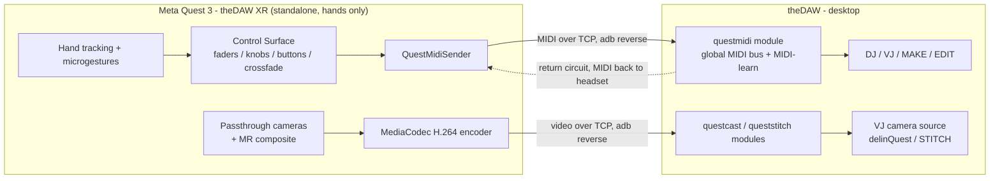
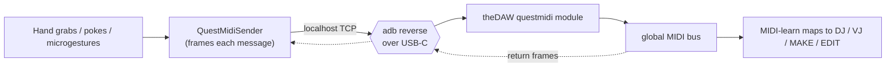
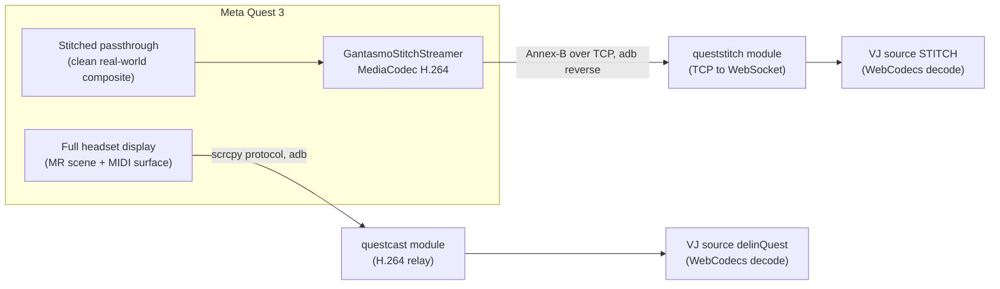
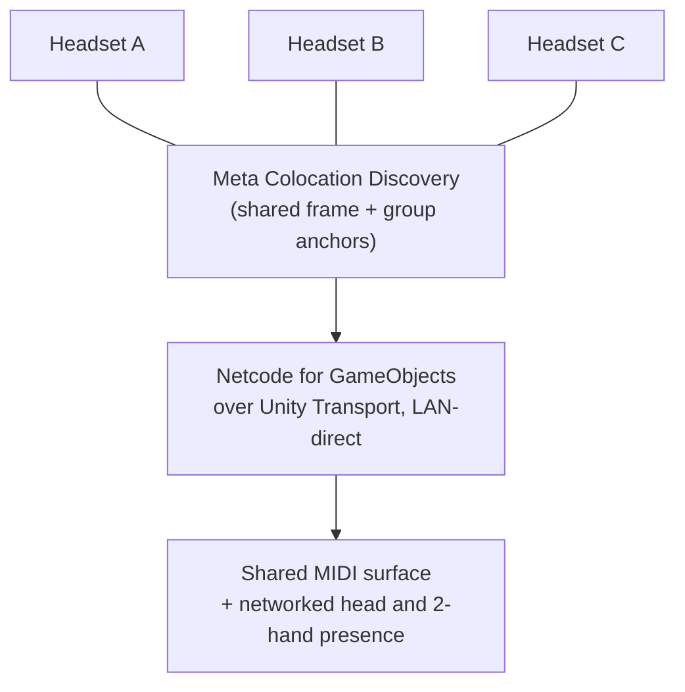

<!--
  theDAW XR - the spatial companion app for theDAW.
  Keywords: Meta Quest 3, mixed reality, hand tracking, microgestures, MIDI controller,
  XR control surface, passthrough streaming, VJ, music production, Unity 6, OpenXR,
  Meta XR SDK, Netcode for GameObjects, colocation, scrcpy, ADB, MediaCodec, WebMIDI.
-->

# theDAW XR

**The spatial companion app for [theDAW](https://github.com/gantasmo).** theDAW XR is a
standalone Meta Quest 3 application that turns the headset into a hands-only control and
capture surface for a desktop digital audio workstation. Hand tracking becomes MIDI that
drives the DAW, the headset passthrough streams into the DAW's VJ engine as a live video
source, and several headsets share one physical room for co-located performance.

Every link between the headset and the desktop rides plain ADB over the USB-C cable, or a
wireless ADB pairing. Quest Link tethering and Meta Quest Developer Hub (MQDH) casting are
absent from every path, and the desktop runs no OBS and no manually launched scrcpy.

## System architecture

Co-located performance adds a third link that stays between headsets rather than reaching
the desktop. Headsets in the same room align to one shared world frame and exchange
lightweight presence over a LAN-direct transport.

## What it does

Four integrations make up theDAW XR, and each one is usable on its own.

| Integration | Function |
|---|---|
| **Hand-tracked control surface** | A floating 3D surface of faders, knobs, buttons, and a crossfade emits MIDI from hand grabs and pokes. Hand microgestures emit MIDI alongside it. Every message lands on theDAW's global MIDI bus and maps to DJ, VJ, MAKE, or EDIT through MIDI-learn. |
| **Passthrough streaming** | The headset view reaches theDAW's VJ as a live video source over ADB. Two paths cover the full headset display (**delinQuest**) and the clean real-world composite (**STITCH**). |
| **Co-located multiplayer** | A one-click setup wizard wires shared-frame alignment and networked head-and-hands presence so a room of headsets locks the surface and visuals to the same physical spot. |
| **MIDI return circuit** | theDAW sends MIDI back to the headset over the same socket, which drives the reactive **MIDI Reactor** and any other receive-side component. |

## Modules

| Folder | Contents | Documentation |
|---|---|---|
| [`Assets/QuestMidiBridge/`](Assets/QuestMidiBridge/README.md) | The MIDI send-and-return path: `QuestMidiSender`, the microgesture source, and the Setup Wizard | [README](Assets/QuestMidiBridge/README.md) |
| [`Assets/QuestMidiBridge/Runtime/ControlSurface/`](Assets/QuestMidiBridge/Runtime/ControlSurface/README.md) | The floating 3D hand-tracked MIDI surface built from an editable config preset, with an in-VR layout editor | [README](Assets/QuestMidiBridge/Runtime/ControlSurface/README.md) |
| [`Assets/GantasmoPassthrough/`](Assets/GantasmoPassthrough/README.md) | The passthrough stitch and the H.264 streamer that feeds theDAW's VJ as the **STITCH** source | [README](Assets/GantasmoPassthrough/README.md) |
| [`Assets/GantasmoColocation/`](Assets/GantasmoColocation/README.md) | Co-located multiplayer: shared spatial frame and networked head-and-hand presence, with a setup wizard | [README](Assets/GantasmoColocation/README.md) |
| [`Assets/GantasmoVisor/`](Assets/GantasmoVisor/README.md) | The MIDI Reactor, a head-mounted reactive chrome driven by the return circuit | [README](Assets/GantasmoVisor/README.md) |
| [`Assets/QuestMidiBridge/Bridge~/`](Assets/QuestMidiBridge/Bridge~/README.md) | An optional desktop Node bridge for any other WebMIDI DAW (the `~` keeps it out of the APK) | [README](Assets/QuestMidiBridge/Bridge~/README.md) |

## Requirements

- **Unity 6.x** (this project targets 6000.4.x with URP 17.4.0) on **Windows**.
- **Meta XR SDK** `com.meta.xr.sdk.all` 203.0.0 (Interaction SDK plus Building Blocks).
- A **Meta Quest 3** in Developer Mode, Horizon OS **v203**, with hand tracking enabled.
- **adb** (Android platform-tools) for the USB or wireless tunnel.
- **theDAW** running on the same desktop, with its `questmidi`, `questcast`, and
  `queststitch` backend modules enabled.
- Co-located multiplayer adds **Netcode for GameObjects** 2.12 and **Unity Transport**
  2.7.2; the setup wizard installs the building blocks.
- The optional Node bridge adds **Node.js** and **loopMIDI**, and only applies to a
  WebMIDI DAW other than theDAW.

## Quick start

1. Open the project in Unity and load `Assets/Scenes/QuestMIDI.unity`.
2. Open **GANTASMO > MIDI Bridge > Setup Wizard** and work down the checklist (developer
   mode, ADB detection, bridge config). The final step builds or repairs the XR MIDI
   surface and validates the scene wiring.
3. Enable theDAW's `questmidi` backend module. With theDAW open, its MIDI input list shows
   the headset's controls on the global MIDI bus, ready to map with MIDI-learn.
4. Build and deploy the Android app to the Quest, or press **Play** in the Editor to test
   the MIDI chain on the desk first (see [Testing without the headset](#testing-without-the-headset)).
5. For video, select **delinQuest** or **STITCH** in theDAW's VJ source list; the backend
   starts the relay it needs.
6. For a multi-headset set, run **GANTASMO > Colocation > Setup Wizard** on each headset.

## How MIDI reaches theDAW

The simplest route uses no extra desktop software.

`QuestMidiSender` frames each MIDI message and sends it over a localhost TCP socket that
`adb reverse` tunnels across the cable. theDAW's `questmidi` backend module listens on that
socket and republishes the MIDI onto the browser's global MIDI bus, where it behaves like
any hardware controller and is mappable across DJ, VJ, MAKE, and EDIT.

The bridge runs both directions. theDAW can send MIDI back to the headset over the same
socket, where receive-side components react to it live.

A second route serves any WebMIDI DAW that is not theDAW: the desktop Node bridge in
[`Bridge~/`](Assets/QuestMidiBridge/Bridge~/README.md) relays the same TCP frames into a
**loopMIDI** virtual port that the DAW opens as an ordinary MIDI input. One route or the
other carries the MIDI, never both at once.

## Streaming without MQDH or Quest Link

Two independent video paths reach theDAW's VJ engine, both over ADB.

- **delinQuest** mirrors the entire headset display, the mixed-reality scene plus the
  performer's MIDI surface. The `questcast` backend module runs a relay that speaks the
  scrcpy protocol to the headset and streams H.264 to the browser, decoded with WebCodecs.
- **STITCH** streams only the clean stitched passthrough, the real-world composite without
  the overlaid surface, as a separate source. `GantasmoStitchStreamer` encodes the stitch
  render texture with Android MediaCodec and sends it over an ADB-reversed socket to the
  `queststitch` backend bridge.

Neither path opens a Quest Link session and neither uses MQDH casting. The headset needs
only USB debugging enabled, or a wireless ADB pairing. Details live in the
[passthrough README](Assets/GantasmoPassthrough/README.md).

## Co-located performance

Several headsets in one room align to a single world frame through Meta Colocation
Discovery and group-shared spatial anchors, so the surface and visuals occupy the same
physical place for everyone. Each headset broadcasts a lightweight head-and-hands proxy
over Netcode for GameObjects on a LAN-direct transport, with no cloud relay and no external
account. The existing ADB sockets keep carrying video and MIDI; the netcode handles only
presence. The [colocation README](Assets/GantasmoColocation/README.md) covers the manual
Meta platform gates.

## Testing without the headset

Pressing **Play** in the Editor with theDAW running exercises the full MIDI path on the
desk. `QuestMidiSender` connects to the PC's own `127.0.0.1`, so `adb reverse` matters only
once the app runs on the headset. The MediaCodec video encoder is Android-only, so the
streamed picture needs a real device, although the Editor still exercises the relay
plumbing.

## Editor menu

Every authoring action lives under one **GANTASMO** top menu in the Unity Editor, grouped
by module.

| Menu path | Action |
|---|---|
| **GANTASMO > MIDI Bridge > Setup Wizard** | Open the bridge setup wizard (developer mode, ADB, bridge config, surface build/repair) |
| **GANTASMO > MIDI Bridge > Open Bridge Folder** | Reveal the desktop Node bridge folder |
| **GANTASMO > Control Surface > Build XR MIDI Control Surface** | Build the surface from the default config preset |
| **GANTASMO > Control Surface > Build Surface From Selected Config** | Build from the preset selected in the Project window |
| **GANTASMO > Control Surface > Create Surface Config Preset** | Create a new preset asset to edit |
| **GANTASMO > Control Surface > Reset Surface Config To Default Layout** | Rewrite the default preset to the curved DJ layout |
| **GANTASMO > Control Surface > Capture Surface Layout Into Default Config** | Save a hand-arranged surface back into the default preset |
| **GANTASMO > Control Surface > Capture Surface Layout Into Selected Config** | Save a hand-arranged surface back into the selected preset |
| **GANTASMO > Control Surface > Repair XR MIDI Surface Interactions** | Add the missing hand-grab to sliders and knobs on an older surface |
| **GANTASMO > Passthrough > Add Passthrough Stitch To Scene** | Add the passthrough stitch and the STITCH streamer to the scene |
| **GANTASMO > Colocation > Setup Wizard** | Open the co-located multiplayer setup wizard |
| **GANTASMO > MIDI Reactor > Add To Scene** | Add the head-mounted MIDI-reactive chrome to the scene |

## Troubleshooting

**Sliders or knobs do not move or send MIDI while buttons work.** The surface's sliders and
knobs need a `HandGrabInteractable`. The Building Blocks comprehensive rig ships hand-grab
and poke interactors but no plain `GrabInteractor`, so a bare `GrabInteractable` is never
grabbed and the handle never moves. Run **GANTASMO > Control Surface > Repair XR MIDI
Surface Interactions** (or the wizard's *Repair Interactions* button). Freshly built
surfaces already include it. Details are in the
[control surface README](Assets/QuestMidiBridge/Runtime/ControlSurface/README.md#slidersknobs-do-nothing-repair-an-older-surface).

**No MIDI reaches the DAW.** Confirm `adb reverse` is set (the wizard has a one-click
button and theDAW's module sets it on start), the sender's TCP port matches, and the
`questmidi` module is enabled in theDAW.

**No video in the VJ.** Confirm the headset is listed by `adb devices`, USB debugging is
accepted on the headset, and the matching backend module is enabled (`questcast` for
delinQuest, `queststitch` for STITCH). For STITCH, the scene must contain a
`GantasmoStitchStreamer`, which **GANTASMO > Passthrough > Add Passthrough Stitch To Scene**
adds.

## Project notes

- Source control is **Git** (`gantasmo/theDAW-XR`). A Unity Version Control (Plastic)
  workspace also lives alongside it, and the `.plastic/` folder is gitignored.
- The repository ships as a **Unity project plus the optional desktop bridge**, not a UPM
  package (there are no asmdefs).
- `Bridge~/node_modules/` is present for local runs and should be excluded from any release
  artifact; the bridge re-installs from `package.json`.
- The app identity defaults (`DefaultCompany`, the `com.UnityTechnologies...urpblank`
  package name) need production values before a store build.

## Support the project

theDAW XR and theDAW are built by a small, independent, self-funded team. Sponsorships and
one-time donations pay for headset hardware, test devices, and the time that keeps both
projects moving forward. Every contribution goes straight back into development.

Sharing the project, filing issues, and opening pull requests also help, and they cost
nothing.

---

theDAW XR pairs a Meta Quest 3 with theDAW for live music performance: hand-tracked MIDI
control, mixed-reality passthrough streaming into a VJ engine, co-located multiplayer, and
a head-mounted MIDI Reactor, all over plain ADB.
